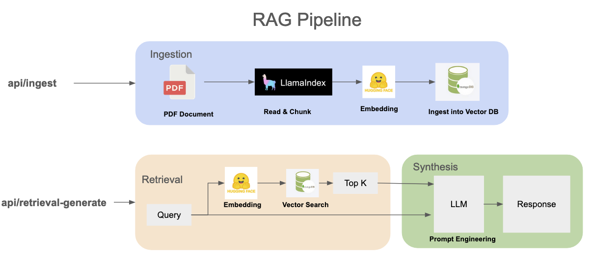
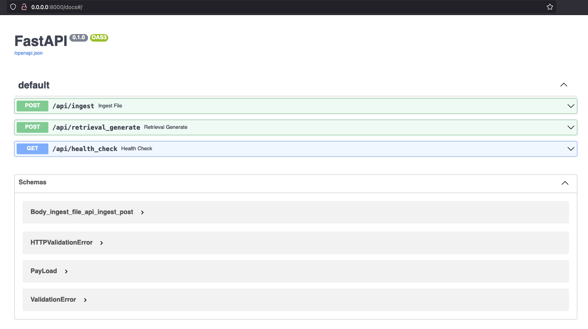

# FastAPI PDF Retrieval Augmented Generation (RAG)

## Run Backend API Locally

```shell
python -m venv venv
source venv/bin/activate
pip3 install -r requirements.txt

source .env
uvicorn app.server:app --reload-dir app --host 0.0.0.0 --port 8000
# or

sh boot.sh
```

## Build Docker
```shell
image_name=rag-backend-api
docker build -t ${image_name}:latest -f ./Dockerfile . --platform linux/arm64/v8
docker run --env-file docker.env -p 8000:8000 -it --rm --name ${image_name} ${image_name}:latest
```
## API Description and RAg Pipeline





###  Process and Ingest PDF file  
`/api/ingest`

The process of reading a PDF, making chunks, encoding sentences to embeddings, and loading them into a vector search database follows a structured workflow to ensure efficient and accurate retrieval of information. 

### Retrieve Augmented Generate (RAG):
 `/api/retrieval_generate` 

Provide answers to user queries based on the previously ingested PDF document. Encoding user query to search to performs a vector search by comparing the query vector, based on retrieved content, generate result by using prompt and the user's question passed to the OpenAI GPT-3.5 Turbo model.

Example:
```json
{
  "context": "Asset allocation with a duration",
  "question": "Given the criteria, if the percentage of the portfolio with a duration longer than 7 years is less than 20%, answer me Yes or No, does this document satisfy this criteria?",
  "file_name": "SUNY RF - General Investment Policy and Guidelines.pdf"
}
```
